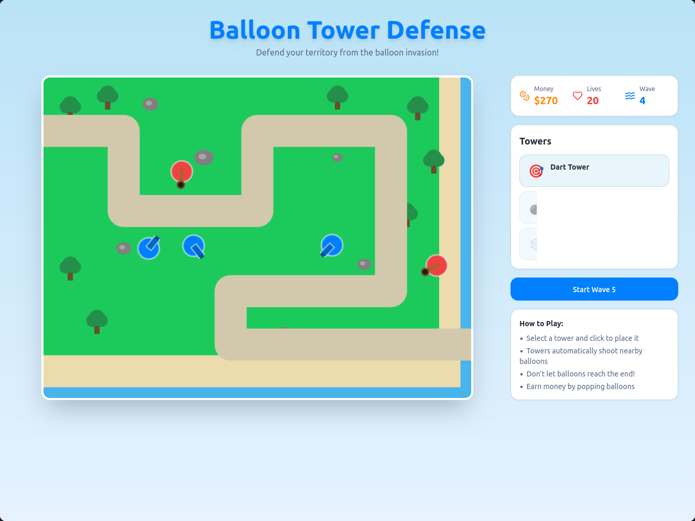

# Ballon Tower Defense

```
# Step 1: Clone the repo
git clone https://github.com/nnh12/Ballon-Tower-Defense.git

# Step 2: Navigate to directory.
cd Ballon-Tower-Defense

# Step 3: Install the necessary dependencies.
npm i

# Step 4: Start the development server with auto-reloading and an instant preview.
npm run dev
```

          
